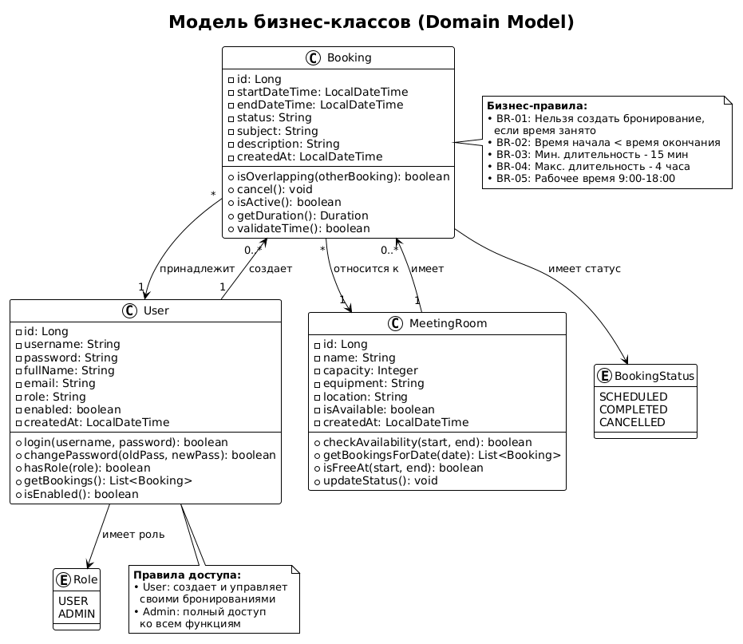
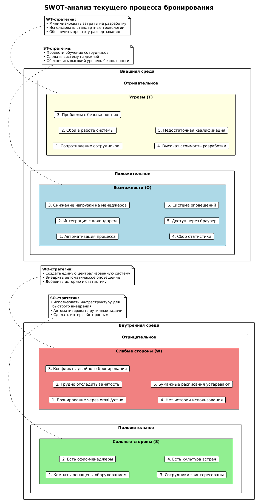

# Этап 0: Инициация и бизнес-анализ

## Выполненные артефакты

| № | Артефакт | Статус | Файл |
|---|----------|--------|------|
| 1 | Паспорт проекта | ✅ Готов | [project-charter.md](project-charter.md) |
| 2 | Диаграмма бизнес-контекста (IDEF0) | ✅ Готов | [context-diagram.md](context-diagram.md) |
| 3 | BUC-диаграмма | ✅ Готов | [buc-diagram.md](buc-diagram.md) |
| 4 | Бизнес-глоссарий | ✅ Готов | [glossary.md](glossary.md) |
| 5 | Модель бизнес-классов | ✅ Готов | [business-classes.md](business-classes.md) |
| 6 | Матрица стейкхолдеров | ✅ Готов | [stakeholders.md](stakeholders.md) |
| 7 | SWOT-анализ | ✅ Готов | [swot-analysis.md](swot-analysis.md) |

## Ссылки на изображения

| Диаграмма | Изображение |
|-----------|-------------|
| IDEF0 A-0 |  |
| BUC-диаграмма |  |
| Модель бизнес-классов |  |
| Матрица стейкхолдеров |  |
| SWOT-анализ |  |
