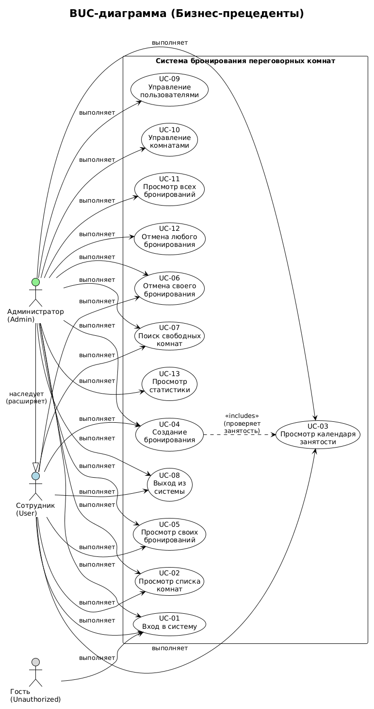

# BUC-диаграмма (Бизнес-прецеденты)

## Диаграмма

## Акторы

| Актор | Описание |
|-------|----------|
| **Сотрудник (User)** | Обычный пользователь |
| **Администратор (Admin)** | Привилегированный пользователь |
| **Гость** | Неавторизованный пользователь |

## Бизнес-прецеденты для сотрудника

| ID | Прецедент | Описание |
|----|-----------|----------|
| UC-01 | Вход в систему | Аутентификация |
| UC-02 | Просмотр списка комнат | Все доступные комнаты |
| UC-03 | Просмотр календаря | Расписание комнаты |
| UC-04 | Создание бронирования | Запись на время |
| UC-05 | Мои бронирования | Список своих бронирований |
| UC-06 | Отмена бронирования | Отмена своего бронирования |

## Бизнес-прецеденты для администратора

| ID | Прецедент | Описание |
|----|-----------|----------|
| UC-09 | Управление пользователями | CRUD пользователей |
| UC-10 | Управление комнатами | CRUD комнат |
| UC-11 | Просмотр всех бронирований | Все бронирования системы |
| UC-12 | Отмена любого бронирования | Админ может отменить любое |
| UC-13 | Просмотр статистики | Отчеты использования |
