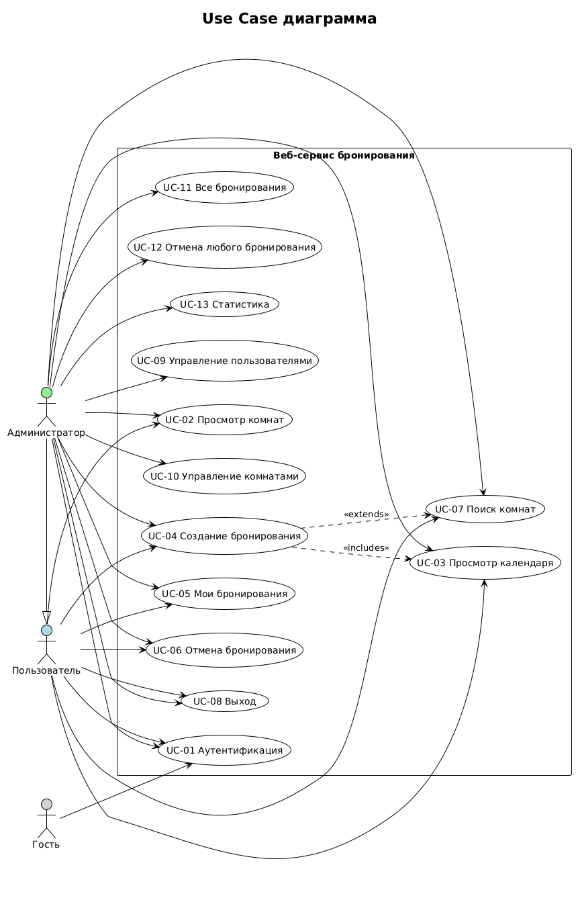
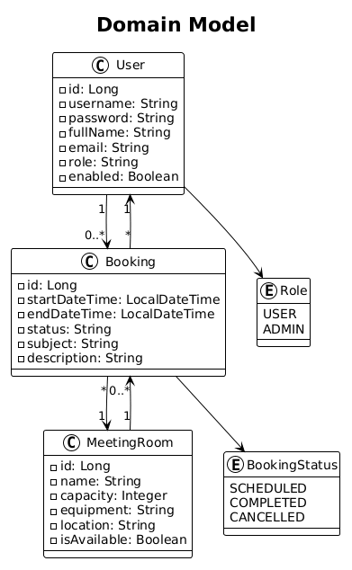

# Этап 1: Проектирование требований

## Выполненные артефакты

| № | Артефакт | Статус | Файл |
|---|----------|--------|------|
| 1 | Use Case диаграмма | ✅ Готов | [use-case-diagram.md](use-case-diagram.md) |
| 2 | Domain Model | ✅ Готов | [domain-model.md](domain-model.md) |
| 3 | Спецификация прецедентов | ✅ Готов | [use-case-specification.md](use-case-specification.md) |
| 4 | Расширенный глоссарий | ✅ Готов | [glossary.md](glossary.md) |
| 5 | Таблица трассировки | ✅ Готов | [traceability-matrix.md](traceability-matrix.md) |

## Ссылки на изображения

| Диаграмма | Изображение |
|-----------|-------------|
| Use Case диаграмма |  |
| Domain Model |  |
