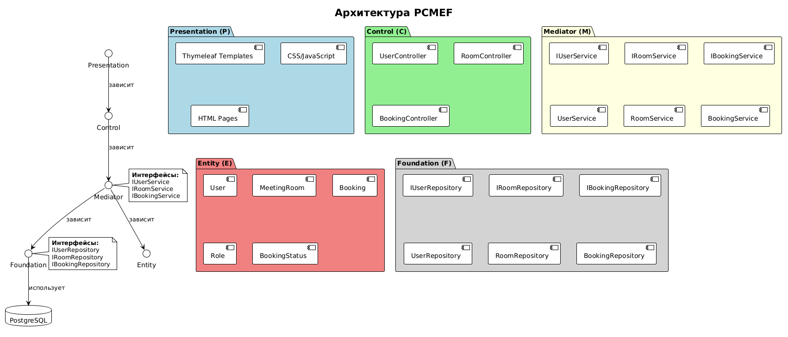
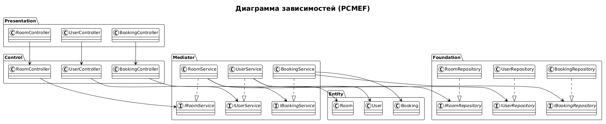

# Этап 2: Архитектурное проектирование

## Выполненные артефакты

| № | Артефакт | Статус | Файл |
|---|----------|--------|------|
| 1 | Диаграмма пакетов PCMEF | ✅ Готов | [pcmef-packages.md](pcmef-packages.md) |
| 2 | Спецификация интерфейсов | ✅ Готов | [interfaces.md](interfaces.md) |
| 3 | Диаграмма зависимостей | ✅ Готов | [dependencies.md](dependencies.md) |
| 4 | ADR (Архитектурные решения) | ✅ Готов | [adr.md](adr.md) |

## Ссылки на изображения

| Диаграмма | Изображение |
|-----------|-------------|
| Диаграмма пакетов PCMEF |  |
| Диаграмма зависимостей |  |
