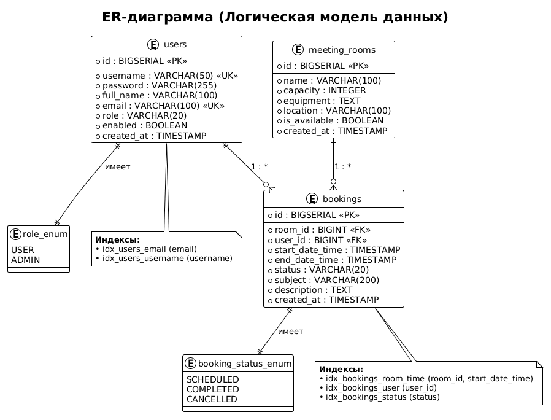

# Этап 3: Проектирование базы данных

## Выполненные артефакты

| № | Артефакт | Статус | Файл |
|---|----------|--------|------|
| 1 | ER-диаграмма | ✅ Готов | [er-diagram.md](er-diagram.md) |
| 2 | DDL-скрипты | ✅ Готов | [ddl-scripts.sql](ddl-scripts.sql) |
| 3 | Описание стратегии ORM | ✅ Готов | [orm-mapping.md](orm-mapping.md) |

## Ссылки на изображения

| Диаграмма | Изображение |
|-----------|-------------|
| ER-диаграмма |  |
