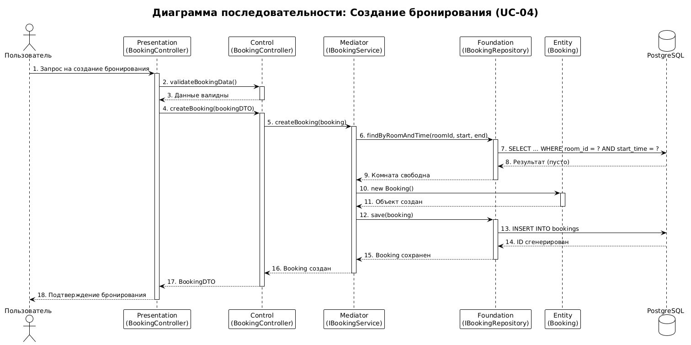
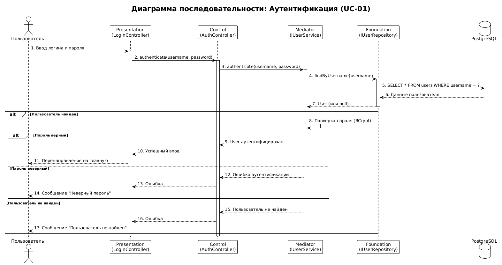
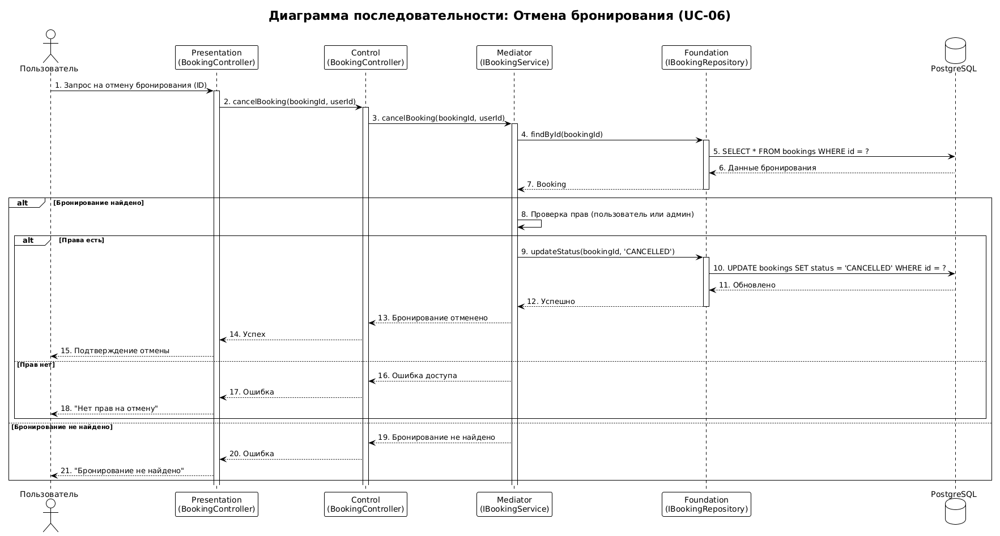
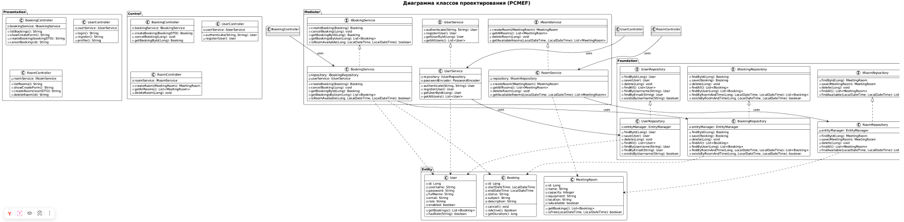

# Этап 4: Детальное проектирование

## Выполненные артефакты

| № | Артефакт | Статус | Файл |
|---|----------|--------|------|
| 1 | Диаграмма последовательности (Создание бронирования) | ✅ Готов | [sequence-booking.md](sequence-booking.md) |
| 2 | Диаграмма последовательности (Аутентификация) | ✅ Готов | [sequence-auth.md](sequence-auth.md) |
| 3 | Диаграмма последовательности (Отмена бронирования) | ✅ Готов | [sequence-cancel.md](sequence-cancel.md) |
| 4 | Диаграмма классов проектирования | ✅ Готов | [design-classes.md](design-classes.md) |
| 5 | Спецификация методов | ✅ Готов | [method-specification.md](method-specification.md) |

## Ссылки на изображения

| Диаграмма | Изображение |
|-----------|-------------|
| Диаграмма последовательности (Создание бронирования) |  |
| Диаграмма последовательности (Аутентификация) |  |
| Диаграмма последовательности (Отмена бронирования) |  |
| Диаграмма классов проектирования |  |
